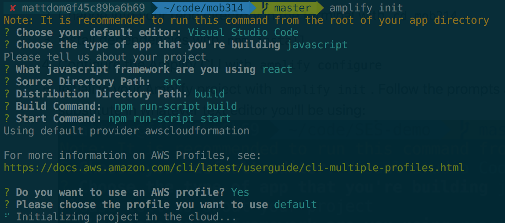

# re:Invent Workshop MOB314
Perform Social Media Sentiment Analysis with Pinpoint and Comprehend

## Use Case
Imagine you are a brand with a large web and mobile presence. You want to monitor the conversation around your brand on social media and message your promoters/influencers and detractors across multiple channels. AWS and Pinpoint provide a great foundation for doing so easily and at massive scale.

## Demo


## Architecture


## Prereqs

1. Install Git by following the instructions here: https://git-scm.com/book/en/v2/Getting-Started-Installing-Git. 
2. Install NPM and Node.js by following the instructions here: https://www.npmjs.com/get-npm. 
3. Install the Amplify CLI globally with `npm install -g @aws-amplify/cli`
4. Download Google Chrome if you don't have it already: https://www.google.com/chrome/. 

## Steps

1. Clone this repo with `git clone https://github.com/mgdombrowski/mob314`
2. Change into your repo directory in the terminal with `cd mob314`.
3. Install dependencies with `npm install`
4. Configure the Amplify CLI with `amplify configure`
5. Initialize your Amplify project with `amplify init`. Follow the prompts and choose the selections shown below. You can substitute in whatever text editor you'll be using: 

6. While your project is initializing, create a Firebase account at https://firebase.google.com/. Create a new project and write down your credentials using the process outlined here: https://firebase.google.com/docs/cloud-messaging/concept-options#credentials. You will need your *Sender ID* and *Server Key*, both of which can be found in the Cloud Messaging tab of the Firebase console Settings pane.
7. Add notifications with `amplify add notifications`, *choose FCM*, choose the default generated Pinpoint project name, and paste your Firebase Server Key from the previous step.
8. Push your local changes to the cloud with `amplify push`. A file `/src/aws-exports.js` was created in your local project. Open this up and copy the `aws_mobile_analytics_app_id`.
9. Launch the backend of the solution with a CloudFormation template using the link here: https://console.aws.amazon.com/cloudformation/home?region=us-east-1#/stacks/create/review?stackName=PinpointStack&templateURL=https://s3.amazonaws.com/mattd-customer-share/mob314.template.yaml. For the parameters, add in your Pinpoint app ID you just copied from Step 7 above. Choose *Next* to accept defaults, select the checkbox at the bottom to acknowledge that CloudFormation may create IAM resources, then click *Create*. 

The stack will take about 15 minutes to launch. When complete, note the `apiGatewayInvokeURL` in the *Outputs* tab of the CloudFormation stack, which we will use later to configure a Facebook Webhook.
10.  Create a Facebook developer account at https://developers.facebook.com/. Create a new application and copy the application ID.
11.  In `/src/App.js` in your local project, add your Facebook app ID from the previous step to the line that reads: ```<FacebookLogin appId="your_app_id_here"```.
12.   In `/public/firebase-messaging-sw.js` in your local project, add your Google sender ID from step 9 above to the line that reads: ```messagingSenderId: 'your_sender_ID_here'```. Do the same again for the file `/src/push-notification.js`.
13.   Login to Facebook and create a Page. Click [here](https://www.facebook.com/help/104002523024878?helpref=about_content) if you don't know how.
14.   Add the *Webhooks* product to your Facebook app:

15.  In the drop-down menu select *Page*, then *Subscribe to this object*:
. For *Callback URL*, paste in the output `apiGatewayInvokeURL` from the CloudFormation template in *Step 8* above. For *Verify Token*, paste in `ThisIsAToken`. 
16. Click the *Subscribe* button under *feed*. This ensures and feed updates on your Facebook page are subscribed to in real-time via Webhook.
17.  Take your app public by pressing the big on button in your Facebook app dashboard: 
 You'll have to add a privacy policy URL, for now you can just enter `https://aws.amazon.com/privacy/`. You also have to add an *App Domain*, so enter `localhost`.
18.  Install your Facebook app on your Page by following the instructions here: https://developers.facebook.com/docs/graph-api/webhooks/getting-started/webhooks-for-pages#install-app. Scroll to the section entitled *Graph API Explorer* and follow the steps accordingly. Add a parameter called `subscribed_fields` and set it equal to `feed`. Your final API call should look like this:
 
19.   Service workers and Facebook login require serving content over HTTPS. To test this locally, we need to launch Chrome with a flag to accept self-signed SSL certificates. 

On a Mac, run: 
```
/Applications/Google\ Chrome.app/Contents/MacOS/Google\ Chrome --user-data-dir=/tmp/foo --ignore-certificate-errors --unsafely-treat-insecure-origin-as-secure=https://localhost:3000
```
For Windows:

```
C:\Program Files (x86)\Google\Chrome\Application\chrome.exe --ignore-certificate-errors --unsafely-treat-insecure-origin-as-secure=https://localhost:3000
```

20.    In your local project, launch the app with `npm start`. You should see Chrome open to `https:localhost:3000`. 
21.    Login with Facebook with the first button then click the second button to register for push notifications. You can open the Chrome Javascript console to see the responses from Facebook and Firebase as your authenticate. 

Now minimize the window to ensure you get the push notification while the app is in the background.
22.    Test the pipeline by posting a comment on your Facebook page (make sure you do this as YOURSELF, not as the page) with POSITIVE sentiment. Use words like good, awesome, best, fun, love, etc. Your should get a browser push notification within a few seconds thanking you for feedback and asking if you want to take a survey.
23.   Follow your Facebook post through the pipeline:
- Navigate to your [Lambda function](https://console.aws.amazon.com/lambda/home?region=us-east-1#/functions). Click on the *Monitoring* tab, then *View Logs in CloudWatch*. Drill into the latest Log Stream and review the Lambda execution logs. How positive was your sentiment score?
- Navigate to the [S3 console](https://s3.console.aws.amazon.com/s3/home?region=us-east-1) and see the object that was created by your post.
- Navigate to the [ElasticSearch console](https://console.aws.amazon.com/es/home?region=us-east-1#). Click on the `page-updates` domain and the Kibana endpoint to visualize your page update. Click the *Discover* tab on the left and look at the documents that were indexed in real-time.
- Navigate to the [Pinpoint console](https://console.aws.amazon.com/pinpoint/home/?region=us-east-1#/apps). Drill into the app you created using the Amplify CLI and click on *Segments* on the sidebar. Create a segment and add a filter by user. You should see a user attribute for *Sentiment* appear and if you select it, an estimate of 1 endpoint will be targeted. You can now schedule a recurring push campaign to target users with positive, neutral or negative sentiment! 

## Cleanup

1. Delete stack in CloudFormation console: https://console.aws.amazon.com/cloudformation/home?region=us-east-1#/stacks?filter=active. 
2. In your mobile project, run `amplify delete` to delete cloud resources for your project.